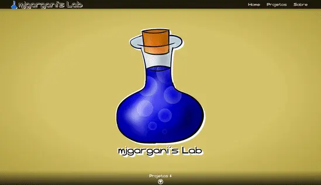

# archive-php-wp_2018-portfolio



## Descrição / Description

Tema para o WordPress (PHP);
Portfolio feito no ano de 2018.

Theme for WordPress (PHP);
Portfolio made in the year 2018.

## Como rodar / How to run

> ⚠️ Necessita de um [navegador web](https://www.mozilla.org/pt-BR/firefox/download/thanks/) e do [Docker](https://docs.docker.com/engine/install/) instalado no host para funcionar.

> ⚠️ Requires a [web browser](https://www.mozilla.org/pt-BR/firefox/download/thanks/) and [Docker](https://docs.docker.com/engine/install/) installed on the host to work.

```bash
docker compose up -d
```

Após iniciar os containers, use o navegador para acessar o endereço `http://localhost:8080/`.

After starting the containers, use the browser to access the address `http://localhost:8080/`.

## Como parar / How to stop

```bash
docker compose down -v
```

## Gerar página estática / Generate static page

Dê ao script `build static`, permissão para execução.

Give the `build static` script execute permission.

```bash
chmod +x ./build_static.sh
```

Execute o script. Ele deve subir o `compose`, baixar a versão estática da página e derrubar os containers.

Run the script. It should run `compose`, download the static version of the page and tear down the containers.

```bash
sh ./build_static.sh
```

A página poderá ser acessada em `./static/index.html`.

The page can be accessed from `./static/index.html`.
